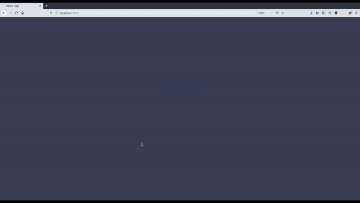

# Diagramme interactif

### Démo

Vous pouvez accéder à la dernière version du projet depuis [aide.e-kot.be](http://aide.e-kot.be/)





### But 

Rendre le diagramme classique interactif et plus attrayant afin de soulager nos messages Facebook

### Ajouter de nouveaux diagrammes 
```bash
$ cd interactive-diagram/backend/diagram
$ touch <nom du diagramme>.json
```
Modifier le *json* afin de créer le diagramme <br />
L'importer au sein du fichier `index.js` <br />
Relancer le backend, done ! <br />
Pour plus de précisions voir le fichier `interactive-diagram/backend/diagram/README.md` 


------------

### Getting Started

The commands below will start the development server 

``````bash
$ cd interactive-diagram
``````

##### Docker :

``````bash
$ docker-compose build # Run this only the first time, no need after
$ docker-compose up [-d, --detach] 
``````

##### Start without Docker :

###### Start front and back simultaneously

````````bash
# In your first terminal
$ cd frontend
$ npm install
$ npm start

# Open up a second terminal 
$ cd backend
$ npm install
$ npm start
````````

Go on your `localhost`, client is running on port 70 (docker) or 3000 (npm development server)
(Backend's listening on port `8080` in both docker and local configuration)


### Production 

##### Without Docker 

``````bash
# In your first terminal
$ cd frontend
$ npm install
$ npm install -g serve
$ npm run build
$ serve -s build

# Open up a second terminal 
$ cd backend
$ npm install
$ NODE_ENV production
$ npm start
``````


##### Docker

###### Edit the Dockerfile in the frontend folder

`````dockerfile
FROM node:10

# Create app directory
WORKDIR /usr/src/app
COPY package*.json ./

# Install app dependencies
RUN npm install
RUN npm install -g serve

# Bundle app source
COPY . .

# Exposing the port (5000 is the default for npm's serve package)
EXPOSE 5000

# Building for production
RUN npm run build 

CMD ["serve", "-s", "build"] 
`````

###### Edit the Dockerfile in the backend folder

`````dockerfile
FROM node:10

# Create app directory
WORKDIR /usr/src/app
COPY package*.json ./

# Install app dependencies
RUN npm install

# Bundle app source
COPY . .

# Telling NodeJS that this is for prod
ENV NODE_ENV production

# Exposing the port (5000 is the default for npm's serve package)
EXPOSE 8080

CMD ["npm", "start"] 
`````

###### Edit docker-compose.yml 

`````dockerfile
...
  frontend:
    build: ./frontend
    ports:
      - "XX:5000"
...
`````

*Note : Replace `XX` with wathever port you'd like the app to be served on*

###### Finally, build and launch the app in detach mode 

`````bash
$ cd interactive-diagram
$ docker-compose up --build -d
`````

