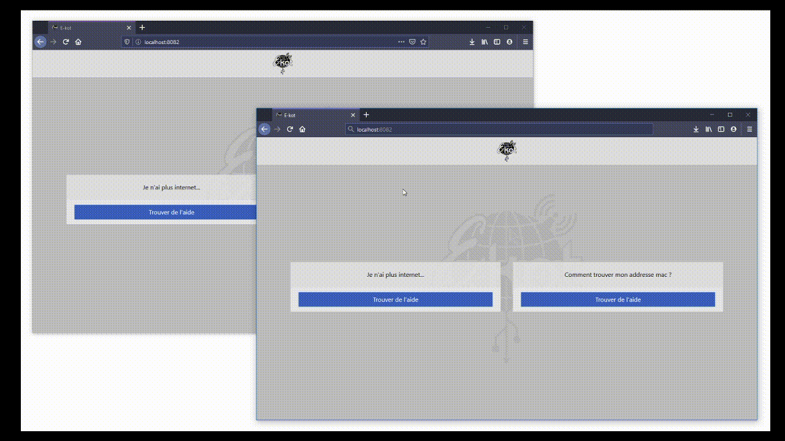

# Diagramme interactif

### But 
Rendre le diagramme classique interactif et plus attrayant afin de soulager nos messages Facebook





### Getting Started

The commands below will start the development server 

``````bash
$ cd interactive-diagram
``````

##### Docker :

``````bash
$ docker-compose build # Run this only the first time, no need after
$ docker-compose up [-d, --detach] 
``````

##### Start without Docker :

###### Start front and back simultaneously

````````bash
# In your first terminal
$ cd frontend
$ npm install
$ npm start

# Open up a second terminal 
$ cd backend
$ npm install
$ npm start
````````

Go on your `localhost`, client is running on port 80
(Backend's listening on port `8080` in both docker and local configuration)


###### Si tu veux le mettre en production je te laisse faire les recherches gros

